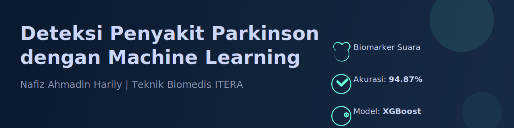

<p align="center">
  
</p>

# Sistem Deteksi Penyakit Parkinson Menggunakan Machine Learning

Sistem deteksi Parkinson disease menggunakan Machine Learning dengan berbagai algoritma klasifikasi.

## 📋 Deskripsi

Sistem ini dibuat untuk membantu mendeteksi penyakit Parkinson berdasarkan data biomedis. Menggunakan berbagai algoritma machine learning untuk memberikan prediksi yang akurat.

## 🗂️ Struktur Project

```
project-alzheimer/
├── data/                      # Dataset
│   └── parkinsons.csv        # Dataset Parkinson (letakkan di sini)
├── notebooks/                 # Jupyter Notebooks
│   ├── 01_exploratory_data_analysis.ipynb
│   └── 02_model_training.ipynb
├── src/                       # Source code
│   ├── data_loader.py        # Modul untuk load data
│   ├── preprocessing.py      # Modul preprocessing
│   ├── model_training.py     # Modul training model
│   ├── model_evaluation.py   # Modul evaluasi model
│   ├── model_utils.py        # Utilities untuk model
│   └── predict.py            # Script untuk prediksi
├── models/                    # Trained models (akan dibuat otomatis)
├── results/                   # Hasil evaluasi dan visualisasi
├── requirements.txt           # Dependencies
├── .gitignore
└── README.md
```

## 🚀 Cara Memulai

### 1. Persiapan Environment

```powershell
# Buat virtual environment
python -m venv venv

# Aktifkan virtual environment
.\venv\Scripts\Activate.ps1

# Install dependencies
pip install -r requirements.txt
```

### 2. Persiapan Dataset

Letakkan dataset Parkinson Anda di folder `data/` dengan nama `parkinsons.csv` atau sesuaikan path di notebook.

**Format Dataset yang diharapkan:**
- File CSV dengan header
- Kolom target (biasanya bernama `status`, `target`, atau `label`)
- Fitur-fitur numerik untuk prediksi

### 3. Jalankan Exploratory Data Analysis

Buka dan jalankan notebook `notebooks/01_exploratory_data_analysis.ipynb` untuk:
- ✓ Memahami struktur dataset
- ✓ Menganalisis distribusi data
- ✓ Melihat korelasi features
- ✓ Identifikasi missing values

```powershell
# Jalankan Jupyter Notebook
jupyter notebook
```

### 4. Training Model

Buka dan jalankan notebook `notebooks/02_model_training.ipynb` untuk:
- ✓ Preprocessing data (scaling, balancing)
- ✓ Training 10 model berbeda
- ✓ Evaluasi dan perbandingan model
- ✓ Save model terbaik

**Model yang digunakan:**
1. Logistic Regression
2. Decision Tree
3. Random Forest
4. Support Vector Machine (SVM)
5. K-Nearest Neighbors (KNN)
6. Naive Bayes
7. Gradient Boosting
8. XGBoost
9. LightGBM
10. CatBoost

### 5. Prediksi dengan Model

Setelah model di-train, gunakan script `predict.py`:

```powershell
# Jalankan script prediksi
python src/predict.py
```

Atau gunakan secara programmatic:

```python
from src.model_utils import ModelUtils

# Load model
model, scaler, features = ModelUtils.load_model_and_params('models/')

# Predict single patient
patient_data = {
    'feature1': 0.5,
    'feature2': 1.2,
    # ... feature lainnya
}

result = ModelUtils.predict_single_patient(model, patient_data, scaler, features)
print(result)
```

## 📊 Output yang Dihasilkan

### 1. Visualisasi
- `results/model_comparison.png` - Perbandingan performa semua model
- `results/confusion_matrix_*.png` - Confusion matrix model terbaik

### 2. Model Files
- `models/*.pkl` - Trained models
- `models/scaler.pkl` - Scaler untuk preprocessing
- `models/feature_names.json` - Nama-nama features

### 3. Results
- `results/evaluation_results.csv` - Hasil evaluasi semua model
- `config.json` - Konfigurasi dataset

<p align="center">
  
</p>

## 📈 Metrics Evaluasi

Sistem mengevaluasi model menggunakan metrics berikut:
- **Accuracy** - Akurasi keseluruhan
- **Precision** - Presisi prediksi
- **Recall** - Sensitivitas
- **F1-Score** - Harmonic mean precision dan recall
- **ROC-AUC** - Area under ROC curve

## 🔧 Kustomisasi

### Mengubah Preprocessing

Edit di `notebooks/02_model_training.ipynb`:

```python
X_train, X_test, y_train, y_test = preprocessor.prepare_data(
    df=df,
    target_col='status',        # Sesuaikan nama kolom target
    drop_cols=['name', 'id'],   # Kolom yang tidak diperlukan
    test_size=0.2,              # Ukuran test set
    scale=True,                 # Scaling
    balance=True,               # Balancing jika imbalanced
    balance_method='smote'      # Method: smote, undersample, smotetomek
)
```

### Menambah Model Baru

Edit file `src/model_training.py` dan tambahkan model di method `initialize_models()`.

## 🐛 Troubleshooting

### ImportError: No module named 'sklearn'
```powershell
pip install scikit-learn
```

### Dataset not found
Pastikan dataset ada di `data/parkinsons.csv` atau sesuaikan path di notebook.

### Model tidak bisa di-load
Pastikan sudah menjalankan training dan model tersimpan di folder `models/`.

## 📝 Catatan Penting

1. **Dataset**: Letakkan dataset di folder `data/`
2. **Target Column**: Pastikan nama kolom target sesuai (status, target, label, dll)
3. **Missing Values**: Sistem akan memberitahu jika ada missing values
4. **Imbalanced Data**: Gunakan parameter `balance=True` jika data tidak seimbang
5. **Feature Names**: Simpan nama features agar konsisten saat prediksi

## 🎯 Next Steps

Setelah model di-train:
1. ✅ Deploy sebagai API (Flask/FastAPI)
2. ✅ Buat GUI dengan Streamlit
3. ✅ Hyperparameter tuning untuk performa lebih baik
4. ✅ Feature engineering untuk features baru
5. ✅ Cross-validation untuk validasi model

## 📚 Resources

- [Scikit-learn Documentation](https://scikit-learn.org/)
- [XGBoost Documentation](https://xgboost.readthedocs.io/)
- [Pandas Documentation](https://pandas.pydata.org/)

## 👨‍💻 Author

Created for Parkinson Disease Detection

## 📄 License

MIT License - Feel free to use for educational purposes

---

**Happy Coding! 🚀**

Jika ada pertanyaan atau menemukan bug, silakan buat issue atau hubungi developer.
